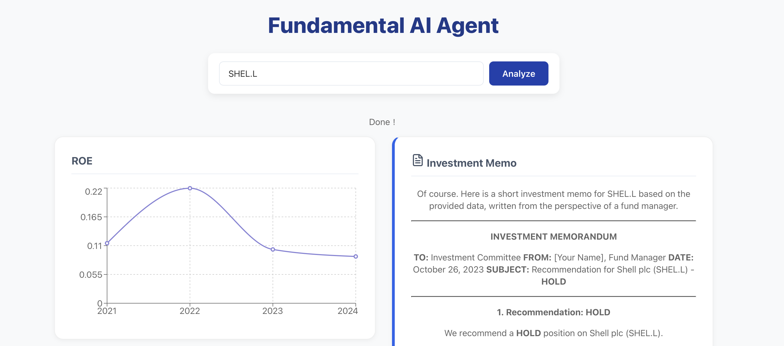

# 🚀 Fundamental AI Agent: Advanced Financial Analysis & Valuation


**Fundamental AI Agent** is a full-stack, conversational financial analysis platform designed to automate the due diligence process for fund managers. It combines comprehensive historical financial analysis (16 core ratios) with advanced valuation models (DCF) and generative AI to deliver actionable investment memos.



---

## ✨ Key Features & Advanced Models

### 📊 Comprehensive Financial Analysis
Extracts historical Balance Sheet, Income Statement, and Cash Flow data (2021-2024) via `yfinance` and calculates over 16 core financial ratios, including:
* **Profitability**: ROE, ROIC, Gross Margin, Net Profit Margin.
* **Leverage**: Debt-to-Equity Ratio, Interest Coverage, Net Debt/EBITDA.
* **Efficiency**: Asset Turnover, Inventory Turnover, Receivables Turnover.
* **Growth**: Revenue Growth, EPS Growth, FCF Growth.

### 💰 Advanced DCF Valuation Engine (New)
The backend incorporates a high-fidelity Discounted Cash Flow (DCF) model for intrinsic value estimation:
* **Cost of Equity (CoE)**: Calculated using the **Fama-French 3-Factor Model** for precise risk adjustment.
* **Future FCF Projection**: Estimated using **Analyst Forward EPS** combined with the company's historical **Cash Conversion Ratio** (FCF/Net Income).
* **Conservative Growth**: Uses a **0.0% perpetual growth rate** assumption, ideal for mature industries (e.g., Energy) to ensure robust valuation.

### 🤖 Conversational AI Agent (Gemini)
* **Intent Recognition**: Uses Gemini to accurately parse natural language queries (including Chinese) and extract the correct US stock ticker (e.g., "Analyze Shell" → SHEL).
* **Memo Generation**: Synthesizes the 16 historical ratios and the DCF valuation result into a professional, concise investment thesis and recommendation.

### 💻 Tech Stack & Infrastructure
* **Frontend**: React (Vite) for a responsive, modern chat interface and **Recharts** for visualizing ratio trends.
* **Backend**: FastAPI (Python) for a highly efficient RESTful API.
* **Data Persistence**: SQLite database for local caching of financial data, reducing API call frequency.

---

## 🛠️ Getting Started

### Prerequisites
* Node.js (v18+)
* Python (v3.10+)
* Google Gemini API Key

### 1. Setup & Installation
```bash
# Clone the repository
git clone [YOUR-REPO-URL]
cd Fundamental-AI-Agent

# Install Python dependencies (requires statsmodels for Fama-French)
cd backend
python -m venv venv
source venv/bin/activate
pip install fastapi uvicorn yfinance pandas numpy google-generativeai setuptools pandas-datareader statsmodels
pip install 'ujson>=5.7.0' # Optional: for performance

# Install Node dependencies
cd ../frontend
npm install
```
Important: Open backend/main.py and replace the GOOGLE_API_KEY variable with your actual API Key.

2. How to Run
You need two separate terminal windows for the backend and frontend.

Terminal 1: Start Backend (API)
```Bash

cd backend
source venv/bin/activate
uvicorn main:app --reload
```
Terminal 2: Start Frontend (Web App)
```Bash

cd frontend
npm run dev
```
The application will run at http://localhost:5173.